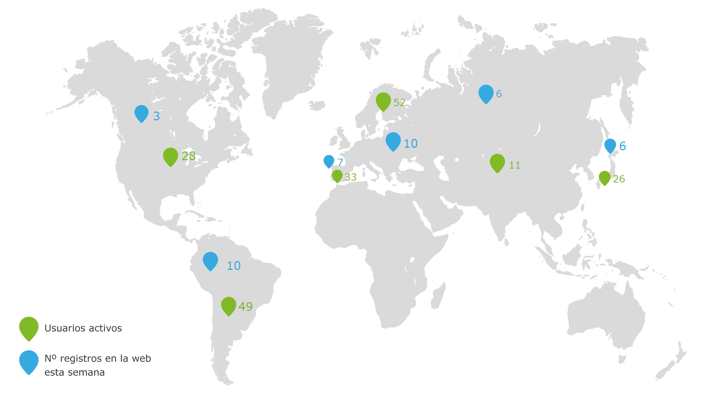

# pandorafms-json-curl-parser
A [Pandora FMS](http://pandorafms.org) server plugin to parse json from webservices.

Read the usage instructions and [documentation of server plugins](http://wiki.pandorafms.com/index.php?title=Pandora:Documentation_en:Remote_Monitoring#Monitoring_with_Plug_Ins_.28Server_Plugin.29) for more information.

## What can I get using this plugin?

You can get to monitor your webservices more easily. And using Pandora FMS' [visual consoles](http://wiki.pandorafms.com/index.php?title=Pandora:Documentation_en:Data_Presentation/Visual_Maps), you can create your own cool dashboards to display the information **like a boss**:

